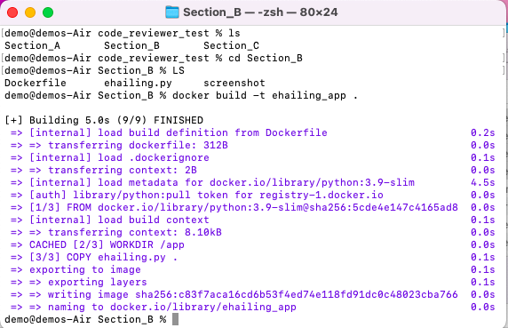
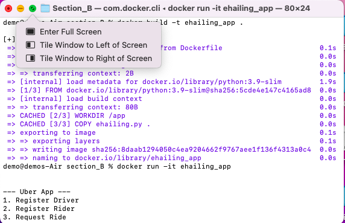

# E-Hailing App

This is a simple e-hailing app implemented in Python using SQLite for data storage. It allows users to register drivers and riders, request rides, complete rides, and view ride status.

## Prerequisites

- Docker: Install Docker on your machine to run the app in a containerized environment.
- Docker Website: https://www.docker.com/

On the Docker website, you'll find installation guides and resources for various operating systems, including Windows, macOS, and Linux. Simply choose your operating system and follow the step-by-step instructions provided.


## Getting Started

1. Clone the repository:
```
git clone https://github.com/moeketsisegalo/ehailing_app.git
```


2. Build the Docker image:
```
docker build -t ehailing_app .
```



3. Run the Docker container:
```
docker run -it --name ehailing_container ehailing_app
```

Follow the on-screen instructions to interact with the e-hailing app.
